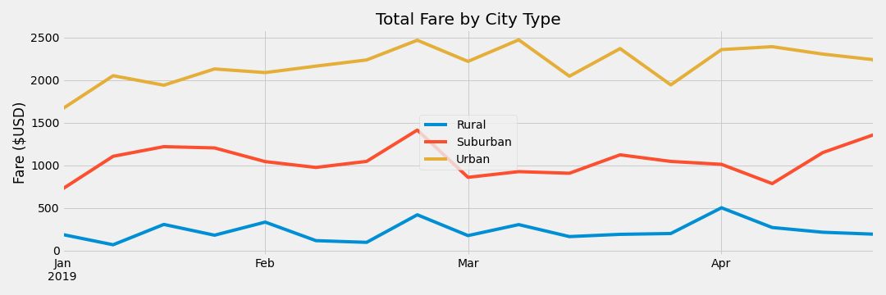

# PyBer_Analysis

## Overview
Analyze all the rideshare data from January to early May of 2019 and create a compelling visualization(s) for the CEO of PyBer. Analytical work involved in this project should be comprehensive and correct.

## Resources
- Data Source: city_data.csv, ride_data.csv
- Software: anaconda3, python 3.7.7, jupyter notebook, matplotlib library

## Results

Raw data is plotted using bubble graph to get a visual idea of the data.
  

Ride count data by city type is shown using a box plot to show the variation between the three city types Urban, Suburban, and Rural.
   
  
Ride fare data by city types is shown using a box plot to show the variation between the three city types Urban, Suburban, and Rural.
   
  
Driver count data by city types is shown using a box plot to show the variation between the three city types Urban, Suburban, and Rural.
  

Following three pie charts show % Totals of Fares, Rides, and Drivers by city types.
      

## Summary

Based on the data collected we can conclude that PyBer need to allocate budget to increase presence in Rural areas by hiring drivers and decreasing the average fares to get more people to use PyBer's services.

## Challenge Overview

Further more additional requirements are added to the assignment to create a summary DataFrame of the ride-sharing data by city type. Then, plot a multiple-line graph that shows the total weekly fares for each city type. Finally submit a written report that summarizes how the data differs by city type and how those differences can be used by decision-makers at PyBer.

## Challenge Results

## Challenge Summary

Based on the challenge results shown above it is clear that we need to add more drivers in Rural areas so more people would use PyBer services. However it is clear that in Urban areas there are more drivers and not all of them have rides, as opposed to Suburban and Rural areas, where each driver has on an average of more than 1 ride under their belt.

### Business Recommendations 
Based on the analysis done, we have the following recommendations for decision makers at PyBer.
 1. Make your presence known in Rural areas by marketing PyBer services in Rural areas.
   - Which results in more drivers joining and more users using PyBer services.
 2. Similarly market PyBer services in Urban areas for user acceptance.
   - We have enough drivers in Urban areas and we need more users to use our services, so focus should be in getting more users to use our services.
 3. For Suburban areas focus sould be split with more on getting more users to use PyBer services, and then on getting more drivers to join PyBer.
 

## Additional technical analysis

The difference between the figures above is when 'pd.to_datetime' conversion is used on the index of the dataframe.

First image has the index as objects when we use loc to create the new dataframe, and the sorting is like this - 4/28/2019, 4/29/2019, and 4/2/2019 before loc is used. This created a big dip in the image in April.

However using to_datetime conversion before using the loc to create the new dataframe created the output figure different and closer to the one shown on the challenge deliverables list.

I am interested to find an explanation.
